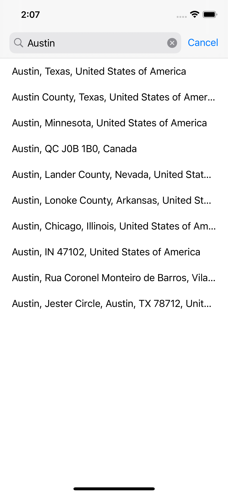
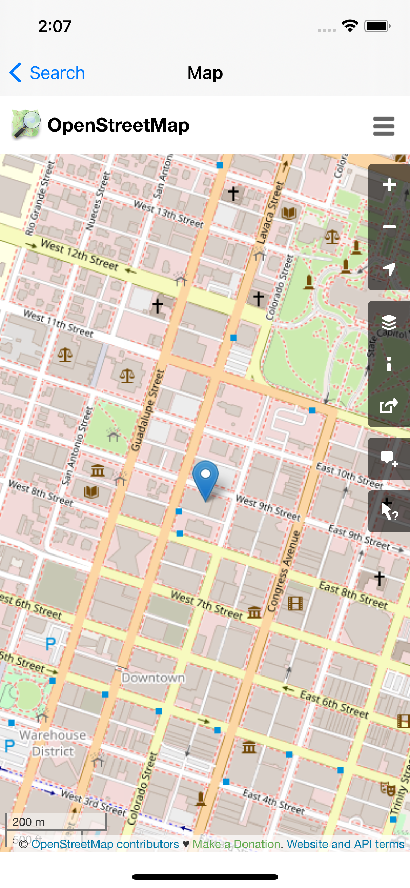

# Map App

## Design Decisions

This application uses an Model-View-ViewModel architecture, with the Coordinator pattern and dependency injection.

The interface is built out with programmatic views and Auto Layout.

Reactive programming is used through the Combine framework to bind a view's content to its corresponding view model.

Networking is implemented with Combine publishers and Codable data structures.

All user-facing strings use `NSLocalizableString` for localization purposes.

## Screenshots

### Search

### Search Results

### Detail / Map View

